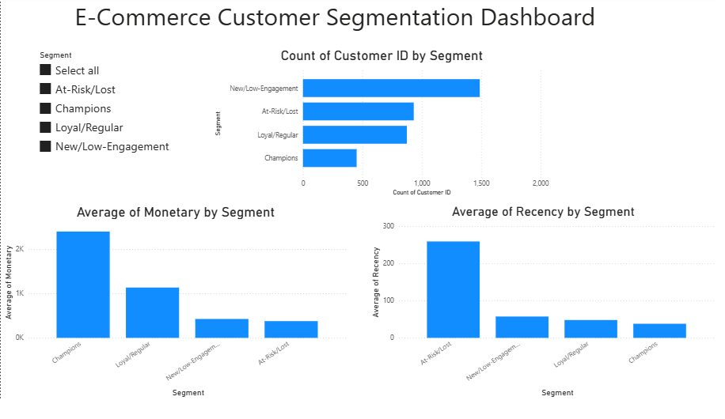

# E-Commerce Sales & Customer Analysis

## Business Problem
Segment e-commerce customers based on purchasing behavior (RFM: recency, frequency, monetary) to help marketing target high-value customers, re-engage at-risk ones, and stop wasting spend on one-time/inactive buyers.

## Dataset
Online Retail II (UCI Machine Learning Repository) — UK-based online retailer transactions, 2010-2011, ~541K rows.

## Tools
Python (pandas, scikit-learn), EDA, K-Means Clustering, Power BI, DAX

## Workflow
1. **Data Cleaning** — Removed rows with missing Customer ID (135K), cancelled orders (negative quantity, 8.9K), and zero-price rows (40)
2. **RFM Feature Engineering** — Calculated Recency, Frequency, Monetary per customer (4,338 customers); removed outliers via IQR method (final: 3,749 customers)
3. **K-Means Clustering** — Scaled RFM features, used Elbow Method to choose K=4, clustered customers into 4 segments
4. **Power BI Dashboard** — Built with 3 visuals, 1 slicer, and a DAX-derived Segment label column

## Dashboard


## Customer Segments Identified
- **Champions** — Recent, frequent, high-spending
- **Loyal/Regular** — Solid repeat buyers
- **New/Low-Engagement** — Recent but low frequency/spend
- **At-Risk/Lost** — Inactive ~8-9 months, low historical spend

## Key Insights
See [docs/insights.md](docs/insights.md) for full write-up.

## Repository Structure
```
data/raw/ — original dataset
data/cleaned/ — cleaned dataset + RFM clustered output
notebooks/ — Python cleaning, RFM, clustering
powerbi/ — Power BI dashboard (.pbix)
docs/ — screenshots & insights
```